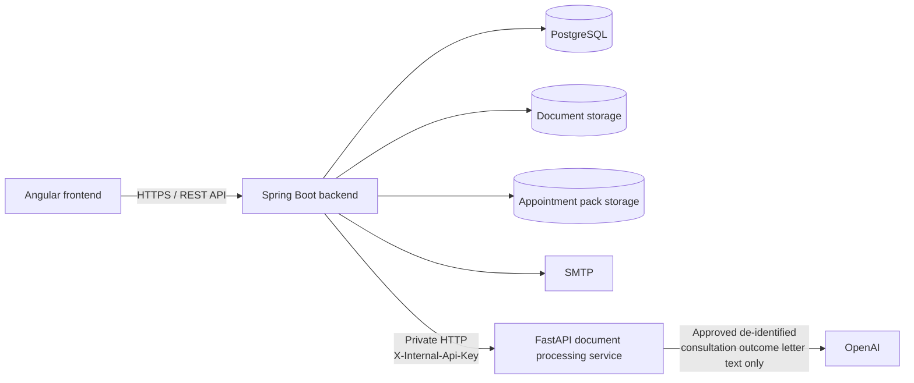

# The Appointment Pack Backend

The Appointment Pack helps patients and carers organise healthcare information and prepare for appointments. It brings together patient details, appointments, medications, contacts, blood results, medical history, healthcare documents, care access, appointment packs, activity history and administrator analytics.

This repository contains the **Spring Boot backend**. It provides the main REST API for the application and handles authentication, permissions, workflow rules, stored application data and integration with the other services.

## Contents

- [Overview](#overview)
- [Architecture](#architecture)
- [Main Features](#main-features)
- [Technology](#technology)
- [Project Structure](#project-structure)
- [Security and Access Model](#security-and-access-model)
- [Configuration](#configuration)
- [Local Development](#local-development)
- [Testing](#testing)
- [Production Deployment](#production-deployment)
- [Administrator Access](#administrator-access)
- [API Reference](#api-reference)
- [Related Components](#related-components)

## Overview

The Spring Boot backend is the main server-side component of The Appointment Pack. It handles:

- registration, login, email verification, password security and TOTP MFA.
- profiles, patient records and patient/carer relationships.
- patient permissions and server-side access checks.
- appointments, medications, contacts, blood results and medical history.
- uploaded document storage and document processing workflows.
- appointment letter review and creation of confirmed appointments.
- consultation outcome letter de-identification, approval and summarisation.
- appointment pack generation, preview, download and storage.
- patient activity history, page telemetry and administrator analytics.
- PostgreSQL persistence and Flyway database migrations.

Document processing is shared with the private FastAPI document processing service. Spring Boot controls when processing can happen and stores the resulting workflow state. The FastAPI service performs the extraction, OCR, appointment letter parsing and consultation outcome letter de-identification algorithms.

## Architecture



The normal application path is:

```text
Browser
-> Angular frontend
-> Spring Boot backend
   -> PostgreSQL
   -> document storage
   -> appointment pack storage
   -> SMTP
   -> FastAPI document processing service
```

The two healthcare document workflows are intentionally separate.

**Appointment letter**

```text
local text extraction or OCR
-> deterministic appointment letter parsing
-> human review and editing
-> Spring Boot saves the confirmed appointment
```

**Consultation outcome letter**

```text
local text extraction or OCR
-> deterministic local de-identification
-> human review and editing
-> explicit approval
-> approved de-identified text
-> OpenAI summarisation through FastAPI
-> human summary review
-> medical history if accepted
```

Original healthcare documents are not sent to OpenAI. Appointment letters stay within the local processing path. Only approved de-identified text from a consultation outcome letter can be sent for summarisation.

## Main Features

### Accounts and access

- Registration with email verification.
- JWT login and TOTP multi-factor authentication.
- Password reset and authenticated password change.
- User profiles and patient records.
- Patient/carer invitations and relationship management.
- Patient-specific permissions for shared access.

### Patient information

- Appointments.
- Medications.
- Healthcare contacts.
- Emergency contacts.
- Blood tests and results.
- Medical history entries.
- Archiving for records that should no longer appear as active.

### Healthcare documents

- PDF, JPEG and PNG uploads with server-side file validation.
- Persistent document storage.
- Appointment letter extraction with editable appointment suggestions.
- Consultation outcome letter de-identification with human privacy review.
- OpenAI summarisation after the de-identified text has been reviewed and approved.
- Human review before a generated summary is added to medical history.
- Retry and recovery support for document processing failures.

### Appointment packs and activity

- PDF appointment pack generation from selected patient information.
- Inline PDF preview and separate download.
- Persistent appointment pack storage.
- Patient activity history.
- Page telemetry and operational analytics.
- Administrator analytics.

## Technology

| Area | Technology |
|---|---|
| Language | Java 25 |
| Framework | Spring Boot 4.1.0 |
| HTTP | Spring MVC |
| Security | Spring Security and JWT |
| Persistence | Spring Data JPA and Hibernate |
| Database | PostgreSQL |
| Migrations | Flyway |
| Validation | Jakarta Bean Validation |
| Email | Spring Mail |
| Internal HTTP | Spring `RestClient` |
| PDF templating | Thymeleaf |
| PDF generation | OpenHTMLtoPDF |
| API documentation | springdoc OpenAPI outside production |
| Build | Maven |
| Testing | JUnit 5, Mockito and Spring Test |

## Project Structure

The codebase is organised by feature under `net.imaginethinking.appointmentpack`:

```text
net.imaginethinking.appointmentpack/
├── analytics/
├── appointment/
├── audit/
├── auth/
├── bloodtest/
├── common/
├── config/
├── contact/
├── document/
├── event/
├── medicalhistory/
├── medication/
├── notification/
├── pack/
├── patientcareraccess/
├── patientrecord/
├── permission/
├── profile/
├── security/
└── user/
```

Controllers define the HTTP API. Services contain application rules and coordinate repository access. Repositories handle PostgreSQL persistence through JPA. Request and response models keep the public API separate from database entities.

Document processing uses short database updates around slower OCR and AI operations. This keeps long-running processing work separate from normal database transactions.

## Security and Access Model

The application has two global roles:

```text
USER
ADMIN
```

Patient and carer access is handled through patient records and relationships rather than separate global patient or carer roles. A user becomes a patient by owning a patient record. Access to another patient's information is provided through an active patient/carer relationship with the required permissions.

For patient data, Spring Boot applies the following model:

```text
authenticated user
-> owns the patient record?
   -> yes: allow
   -> no:
      active patient/carer relationship?
      -> no: deny
      -> yes:
         required permission available?
         -> yes: allow
         -> no: deny
```

Current permissions are:

```text
patient-record:view
patient-record:edit

document:view
document:edit
document:upload

appointment:view
appointment:edit

medication:view
medication:edit

contact:view
contact:edit

blood-result:view
blood-result:edit

history:view
history:edit

appointment-pack:view
appointment-pack:create

audit:view
```

Some permissions depend on more basic access. For example, editing an appointment requires appointment view access, and creating an appointment pack requires appointment pack view access. The backend validates these combinations.

Angular uses the same permission information to control navigation and available actions, but Spring Boot performs the actual security checks.

Calls from Spring Boot to FastAPI use `X-Internal-Api-Key`. The internal key is kept on the server and is never provided to the Angular frontend.

## Configuration

Runtime configuration is supplied through Spring properties and environment variables. Secret values should be provided through the environment rather than committed to the repository.

| Variable | Purpose | Required |
|---|---|---|
| `DB_URL` | PostgreSQL JDBC URL | Yes |
| `DB_USERNAME` | PostgreSQL username | Yes |
| `DB_PASSWORD` | PostgreSQL password | Yes |
| `JWT_SECRET` | JWT signing secret | Yes |
| `FRONTEND_BASE_URL` | Frontend URL used by account workflows | No |
| `CORS_ALLOWED_ORIGINS` | Allowed frontend origins | No |
| `MAIL_FROM` | Sender address for application email | No |
| `MAIL_HOST` | SMTP host | No |
| `MAIL_PORT` | SMTP port | No |
| `MAIL_USERNAME` | SMTP username | Depends on provider |
| `MAIL_PASSWORD` | SMTP password | Depends on provider |
| `MAIL_SMTP_AUTH` | Enable SMTP authentication | No |
| `MAIL_SMTP_STARTTLS` | Enable SMTP STARTTLS | No |
| `MAIL_SMTP_SSL` | Enable SMTP SSL | No |
| `DOCUMENT_STORAGE_DIRECTORY` | Uploaded document storage directory | No |
| `APPOINTMENT_PACK_STORAGE_DIRECTORY` | Appointment pack storage directory | No |
| `DOCUMENT_PROCESSING_BASE_URL` | FastAPI service URL | No |
| `DOCUMENT_PROCESSING_API_KEY` | Shared Spring Boot to FastAPI key | Yes for document processing |
| `DOCUMENT_PROCESSING_STALE_AFTER` | Time before an unfinished processing operation can be recovered | No |
| `DOCUMENT_PROCESSING_RECOVERY_INTERVAL_MS` | Processing recovery check interval | No |
| `SPRING_PROFILES_ACTIVE` | Active Spring profile | Production |

Typical development addresses are:

```text
Angular frontend:             http://localhost:4200
Spring Boot backend:          http://localhost:8080
FastAPI document processing:  http://127.0.0.1:8000
```

## Local Development

### Prerequisites

- Java 25.
- Maven.
- PostgreSQL.
- The FastAPI document processing service for healthcare document workflows.
- An SMTP test server when testing email delivery.

Run the standard Maven workflow from the repository root:

```bash
mvn test
mvn package
mvn spring-boot:run
```

The API is then available at:

```text
http://localhost:8080/api/v1
```

The Angular development configuration expects this address.

## Testing

The backend uses JUnit 5, Mockito and Spring test support. Tests cover the main application rules and higher-risk workflows, including:

- registration, login, email verification, password reset and MFA.
- JWT security and password validation.
- patient/carer relationships and permissions.
- clinical data validation and archiving.
- document upload, processing, review and retry behaviour.
- appointment pack generation and access checks.
- patient activity, telemetry and administrator analytics.

Run the tests with:

```bash
mvn test
```

A production package can be built with:

```bash
mvn package
```

## Production Deployment

Production runs as part of a shared Docker Compose stack with four main services:

```text
frontend
backend
postgres
document-processing
```

The production request path is:

```text
Internet
-> Cloudflare
-> Cloudflare Tunnel
-> Nginx / Angular frontend
-> Spring Boot backend
   -> PostgreSQL
   -> FastAPI document processing service
      -> OpenAI for approved de-identified consultation outcome letter text only
```

Each Compose service runs in its own container. PostgreSQL and the FastAPI document processing service are separate services, and Spring Boot communicates with each of them independently over the private Docker network.

The backend container is not exposed directly to the Internet. Nginx proxies `/api/` requests from the Angular frontend to Spring Boot. PostgreSQL and the FastAPI document processing service also remain private to the Docker network.

Spring Boot owns the persistent uploaded document and appointment pack storage used by the deployed application. These files and the PostgreSQL database are stored outside the disposable application containers so that normal container replacement does not remove application data.

## Administrator Access

Administrator access is assigned by an authorised production operator. It is not available as a normal self-service account action.

Open the production PostgreSQL shell:

```bash
cd /opt/appointment-pack

docker compose exec postgres \
  psql -U appointment_pack -d appointment_pack
```

The current users can be checked before making a change:

```sql
SELECT id, email, role, enabled
FROM users
ORDER BY created_at;
```

Promote the intended existing user using their email address:

```sql
UPDATE users
SET role = 'ADMIN',
    updated_at = NOW()
WHERE email = 'user@example.com';
```

The operator should confirm that the expected row was updated. The user must then log out and sign in again so that a new JWT is issued with the `ADMIN` role.

## API Reference

All public application endpoints use `/api/v1`. The current backend defines **79 mapped public endpoints**. Unless explicitly marked public, a valid bearer JWT is required. Administrator endpoints additionally require `ROLE_ADMIN`.

### Authentication and account security

| Method | Endpoint | Access | Purpose |
|---|---|---|---|
| POST | `/api/v1/auth/register` | Public | Register a user and profile; email verification required |
| POST | `/api/v1/auth/login` | Public | Password login and authentication-state response |
| POST | `/api/v1/auth/login/mfa` | Public | Complete a pending TOTP login challenge |
| POST | `/api/v1/auth/email-verification/resend` | Public | Enumeration-safe verification resend |
| POST | `/api/v1/auth/email-verification/confirm` | Public | Confirm email verification token |
| POST | `/api/v1/auth/password-reset/request` | Public | Enumeration-safe password reset request |
| POST | `/api/v1/auth/password-reset/confirm` | Public | Consume reset token and set a new password |
| GET | `/api/v1/auth/security` | Authenticated | Read the current account security settings |
| POST | `/api/v1/auth/password/change` | Authenticated | Change password after verifying current password |
| POST | `/api/v1/auth/mfa/setup` | Authenticated | Create pending TOTP provisioning data |
| POST | `/api/v1/auth/mfa/confirm` | Authenticated | Confirm TOTP setup |
| POST | `/api/v1/auth/mfa/disable` | Authenticated | Verify a TOTP code and disable MFA |

Successful password login can return one of three application states:

```text
AUTHENTICATED
EMAIL_VERIFICATION_REQUIRED
MFA_REQUIRED
```

### Profiles

| Method | Endpoint | Access | Purpose |
|---|---|---|---|
| GET | `/api/v1/profiles/me` | Authenticated | Read the current user's profile |
| PUT | `/api/v1/profiles/me` | Authenticated | Update the current user's profile |

### Patient records

| Method | Endpoint | Access | Purpose |
|---|---|---|---|
| POST | `/api/v1/patient-records` | Authenticated owner | Create the current user's patient record |
| GET | `/api/v1/patient-records/me` | Owner | Read the current user's patient record |
| GET | `/api/v1/patient-records/{patientRecordId}` | Owner or `patient-record:view` | Read a selected patient record |
| PUT | `/api/v1/patient-records/{patientRecordId}` | Owner or `patient-record:edit` | Update a selected patient record |

A `404` from `/api/v1/patient-records/me` is a valid state when the current user has not yet created a patient record.

### Patient and carer access

| Method | Endpoint | Access | Purpose |
|---|---|---|---|
| POST | `/api/v1/patient-carer-access` | Patient owner | Invite or re-invite a registered carer with permissions |
| GET | `/api/v1/patient-carer-access/{accessId}` | Relationship participant | Read a patient/carer relationship |
| GET | `/api/v1/patient-carer-access/as-patient` | Authenticated owner | List relationship history where caller is the patient |
| GET | `/api/v1/patient-carer-access/as-carer` | Authenticated | List relationship history where caller is the carer |
| PATCH | `/api/v1/patient-carer-access/{accessId}/accept` | Invited carer | Accept a pending invitation |
| PATCH | `/api/v1/patient-carer-access/{accessId}/decline` | Invited carer | Decline a pending invitation |
| PATCH | `/api/v1/patient-carer-access/{accessId}/revoke` | Patient owner | Revoke active access |
| PATCH | `/api/v1/patient-carer-access/{accessId}/cancel` | Patient owner | Cancel a pending invitation |
| PUT | `/api/v1/patient-carer-access/{accessId}/permissions` | Patient owner | Replace permissions on a pending or active relationship |

### Appointments

| Method | Endpoint | Access | Purpose |
|---|---|---|---|
| POST | `/api/v1/patient-records/{patientRecordId}/appointments` | `appointment:edit` | Create an appointment manually |
| GET | `/api/v1/patient-records/{patientRecordId}/appointments` | `appointment:view` | List active appointments |
| GET | `/api/v1/appointments/{appointmentId}` | `appointment:view` | Read appointment details |
| PUT | `/api/v1/appointments/{appointmentId}` | `appointment:edit` | Update an appointment |
| PATCH | `/api/v1/appointments/{appointmentId}/archive` | `appointment:edit` | Archive an appointment |

### Medications

| Method | Endpoint | Access | Purpose |
|---|---|---|---|
| POST | `/api/v1/patient-records/{patientRecordId}/medications` | `medication:edit` | Create medication |
| GET | `/api/v1/patient-records/{patientRecordId}/medications` | `medication:view` | List active medications |
| GET | `/api/v1/medications/{medicationId}` | `medication:view` | Read medication details |
| PUT | `/api/v1/medications/{medicationId}` | `medication:edit` | Update medication |
| PATCH | `/api/v1/medications/{medicationId}/archive` | `medication:edit` | Archive medication |

### Healthcare contacts

| Method | Endpoint | Access | Purpose |
|---|---|---|---|
| POST | `/api/v1/patient-records/{patientRecordId}/healthcare-contacts` | `contact:edit` | Create healthcare contact |
| GET | `/api/v1/patient-records/{patientRecordId}/healthcare-contacts` | `contact:view` | List active healthcare contacts |
| GET | `/api/v1/healthcare-contacts/{healthcareContactId}` | `contact:view` | Read healthcare contact details |
| PUT | `/api/v1/healthcare-contacts/{healthcareContactId}` | `contact:edit` | Update healthcare contact |
| PATCH | `/api/v1/healthcare-contacts/{healthcareContactId}/archive` | `contact:edit` | Archive healthcare contact |

### Emergency contacts

| Method | Endpoint | Access | Purpose |
|---|---|---|---|
| POST | `/api/v1/patient-records/{patientRecordId}/emergency-contacts` | `contact:edit` | Create emergency contact |
| GET | `/api/v1/patient-records/{patientRecordId}/emergency-contacts` | `contact:view` | List active emergency contacts |
| GET | `/api/v1/emergency-contacts/{emergencyContactId}` | `contact:view` | Read emergency contact details |
| PUT | `/api/v1/emergency-contacts/{emergencyContactId}` | `contact:edit` | Update emergency contact |
| PATCH | `/api/v1/emergency-contacts/{emergencyContactId}/archive` | `contact:edit` | Archive emergency contact |

### Blood tests and results

| Method | Endpoint | Access | Purpose |
|---|---|---|---|
| POST | `/api/v1/patient-records/{patientRecordId}/blood-tests` | `blood-result:edit` | Create a blood test with result rows |
| GET | `/api/v1/patient-records/{patientRecordId}/blood-tests` | `blood-result:view` | List active blood tests |
| GET | `/api/v1/blood-tests/{bloodTestId}` | `blood-result:view` | Read blood test details |
| PUT | `/api/v1/blood-tests/{bloodTestId}` | `blood-result:edit` | Update blood test data |
| PATCH | `/api/v1/blood-tests/{bloodTestId}/archive` | `blood-result:edit` | Archive a blood test |

### Medical history

| Method | Endpoint | Access | Purpose |
|---|---|---|---|
| POST | `/api/v1/patient-records/{patientRecordId}/medical-history` | `history:edit` | Create a medical history entry |
| GET | `/api/v1/patient-records/{patientRecordId}/medical-history` | `history:view` | List active medical history entries |
| GET | `/api/v1/medical-history/{entryId}` | `history:view` | Read a medical history entry |
| PUT | `/api/v1/medical-history/{entryId}` | `history:edit` | Update a medical history entry |
| PATCH | `/api/v1/medical-history/{entryId}/archive` | `history:edit` | Archive a medical history entry |

Accepted consultation outcome letter summaries can be added to medical history as `DOCUMENT_SUMMARY` entries.

### Documents and processing

| Method | Endpoint | Access | Purpose |
|---|---|---|---|
| POST | `/api/v1/patient-records/{patientRecordId}/documents` | `document:upload` | Upload a PDF, JPEG or PNG with a document type |
| GET | `/api/v1/patient-records/{patientRecordId}/documents` | `document:view` | List active documents |
| GET | `/api/v1/documents/{documentId}` | `document:view` | Read document metadata |
| GET | `/api/v1/documents/{documentId}/processing` | `document:view` | Read processing and review state |
| POST | `/api/v1/documents/{documentId}/summarise` | `document:edit` | Approve de-identified text for summarisation or retry the same approved snapshot |
| POST | `/api/v1/documents/{documentId}/summary/accept` | `document:edit` + `history:edit` | Accept a reviewed consultation outcome letter summary into medical history |
| POST | `/api/v1/documents/{documentId}/summary/reject` | `document:edit` | Reject generated consultation summary |
| GET | `/api/v1/documents/{documentId}/file` | `document:view` | Download the stored original document and record the activity |
| POST | `/api/v1/documents/{documentId}/extract` | `document:edit` | Start or retry local extraction/processing |
| POST | `/api/v1/documents/{documentId}/appointment/confirm` | `document:edit` + `appointment:edit` | Persist a reviewed appointment from an appointment letter |
| POST | `/api/v1/documents/{documentId}/appointment/reject` | `document:edit` | Reject appointment suggestions from an appointment letter |
| PATCH | `/api/v1/documents/{documentId}/archive` | `document:edit` | Archive a document where lifecycle state permits |

`APPOINTMENT_LETTER` and `CONSULTATION_OUTCOME_LETTER` are the supported document types. Appointment extraction returns suggestions that require user confirmation. Consultation summarisation is a later, explicit operation and sends only the approved de-identified text snapshot to the private processing service.

### Appointment packs

| Method | Endpoint | Access | Purpose |
|---|---|---|---|
| POST | `/api/v1/patient-records/{patientRecordId}/appointment-packs` | `appointment-pack:create` plus required view permissions | Generate an appointment pack PDF |
| GET | `/api/v1/patient-records/{patientRecordId}/appointment-packs` | `appointment-pack:view` | List active appointment packs |
| GET | `/api/v1/appointment-packs/{appointmentPackId}` | `appointment-pack:view` | Read appointment pack metadata |
| GET | `/api/v1/appointment-packs/{appointmentPackId}/preview` | `appointment-pack:view` | Return the PDF inline for preview |
| GET | `/api/v1/appointment-packs/{appointmentPackId}/file` | `appointment-pack:view` | Download the PDF as an attachment and record a download audit event |
| PATCH | `/api/v1/appointment-packs/{appointmentPackId}/archive` | `appointment-pack:create` | Archive an appointment pack |

Preview opens the PDF in the browser without recording a download. The file endpoint downloads the PDF and records the activity.

### Patient audit

| Method | Endpoint | Access | Purpose |
|---|---|---|---|
| GET | `/api/v1/patient-records/{patientRecordId}/audit-events` | `audit:view` | Read paginated patient activity history |

### Page telemetry

| Method | Endpoint | Access | Purpose |
|---|---|---|---|
| POST | `/api/v1/analytics/page-views` | Public route, anonymous only for `LANDING` | Record a coarse application page category |

Telemetry records a constrained page enum rather than raw URLs, patient IDs or clinical values.

### Administrator analytics

| Method | Endpoint | Access | Purpose |
|---|---|---|---|
| GET | `/api/v1/admin/analytics/summary` | `ROLE_ADMIN` | Read aggregate operational analytics for a validated date range |
| GET | `/api/v1/admin/analytics/events` | `ROLE_ADMIN` | Read paginated and filterable operational events |

**Endpoint count: 79.**

## Related Components

The application is split across three repositories:

- **Angular frontend**: browser presentation, routing, forms, selected patient context and permission-aware UX.
- **Spring Boot backend**: this repository. It handles the main application API, security, workflow and stored application data.
- **FastAPI document processing service**: private document extraction, OCR, appointment letter parsing, consultation outcome letter de-identification and approved-text summarisation.

Angular communicates with Spring Boot. Spring Boot stores application data and calls the private FastAPI service when document processing is required.
